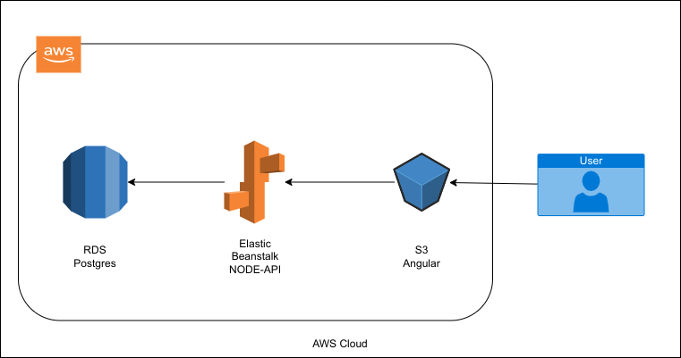

# Infrastructure Description

## AWS Services

* RDS
	- Postgres database for storing users and feeds
	

* Elastic Beanstalk
	- Node environment for hosting the api
	

* S3
	- Static hosting for the front-end

## Diagram

