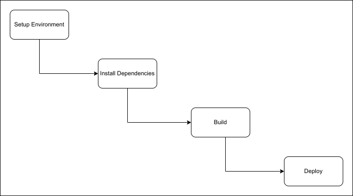
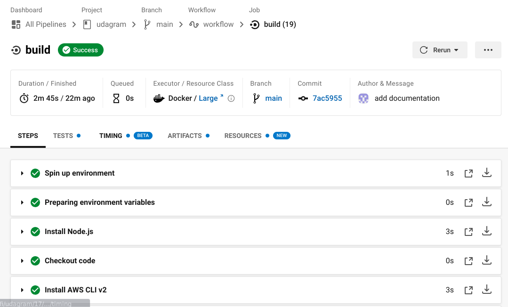
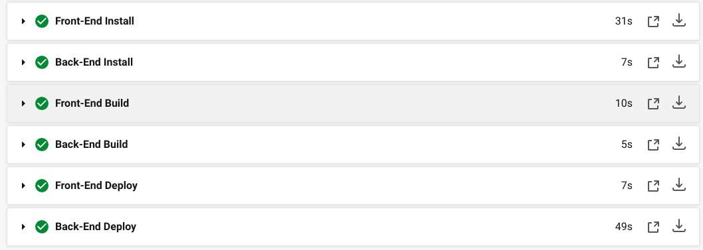

# Pipeline process

## Process :

1. setup the environment by installing node.js , aws cli, and elastic beanstalk cli using orbs.

2. install deficiencies for the front-end and the back-end

3. build the front-end and the back-end

4. deploy the front-end and the back-end

## Steps :

1. Install Node.js
2. Checkout Code
3. Setup AWS CLI
4. Setup Elastic Beanstalk CLI
5. Front-End Install
6. Back-End Install
7. Front-End Build
8. Back-End Build
9. Front-End Deploy
10. Back-End Deploy

